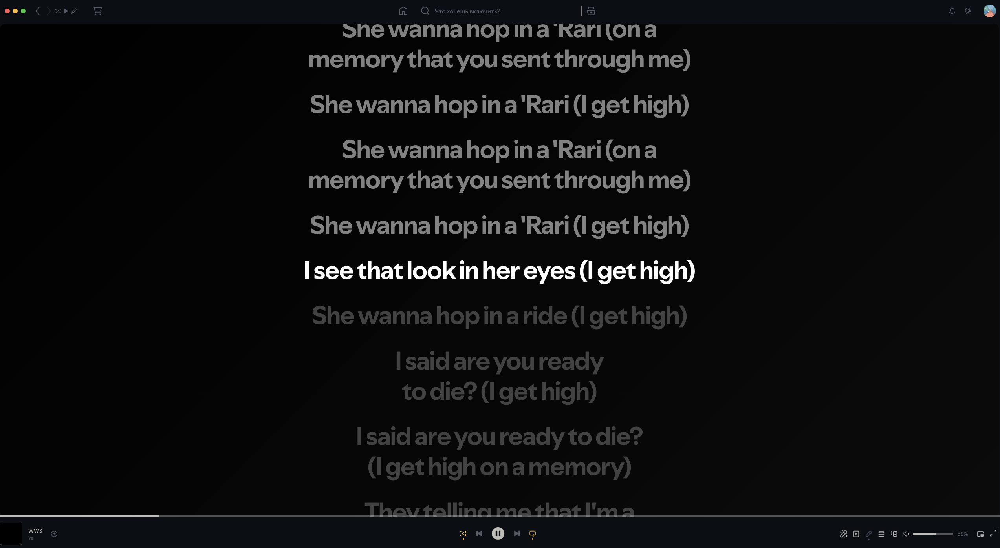

# nightlabe
spicetify theme for spotify

# Spicetify theme screenshots

## Menu

## Search

## Vocal

# How to download theme

### Open `C:\Users\USERNAME\.spicetify\Themes` **OR** `~/.config/spicetify/Themes` and create folder nightlabe and 
### 
#### **Put in** `color.ini` **and** `user.css`
### after open `C:\Users\USERNAME\.spicetify\Themes` **OR** `~/.config/spicetify/config-xpui.ini ` 
### and change 
### `current_theme = nightlabe`

`spicetify apply`
